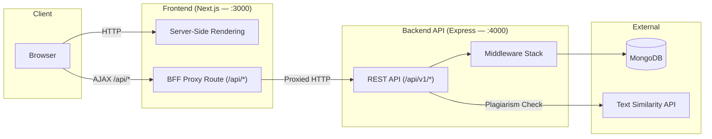
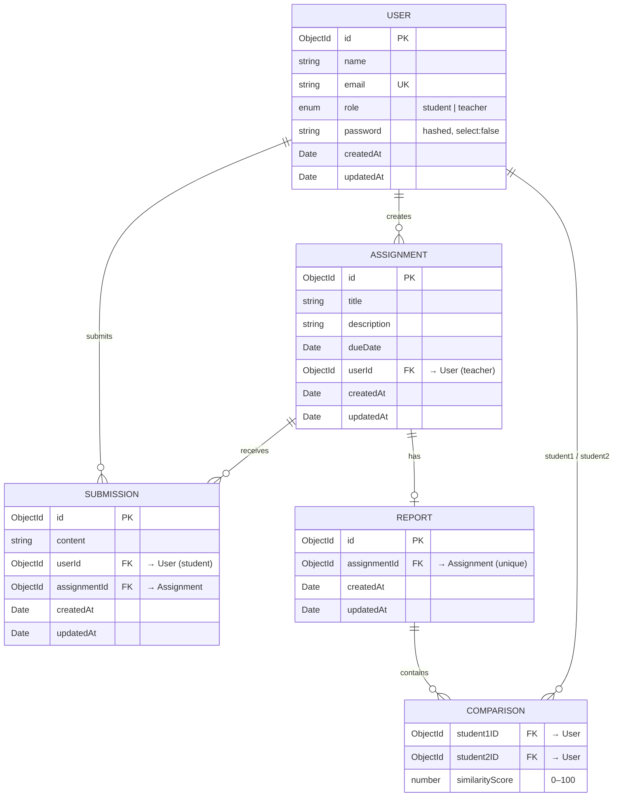
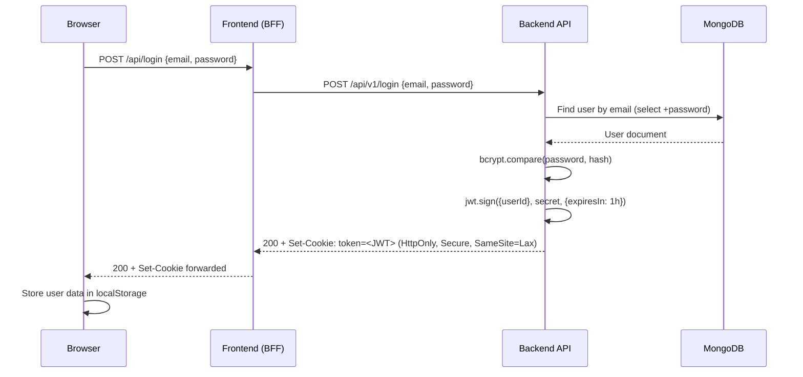
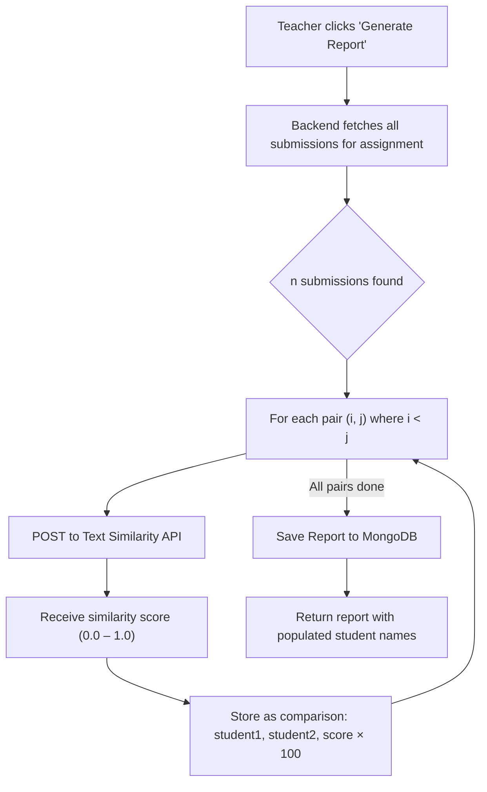
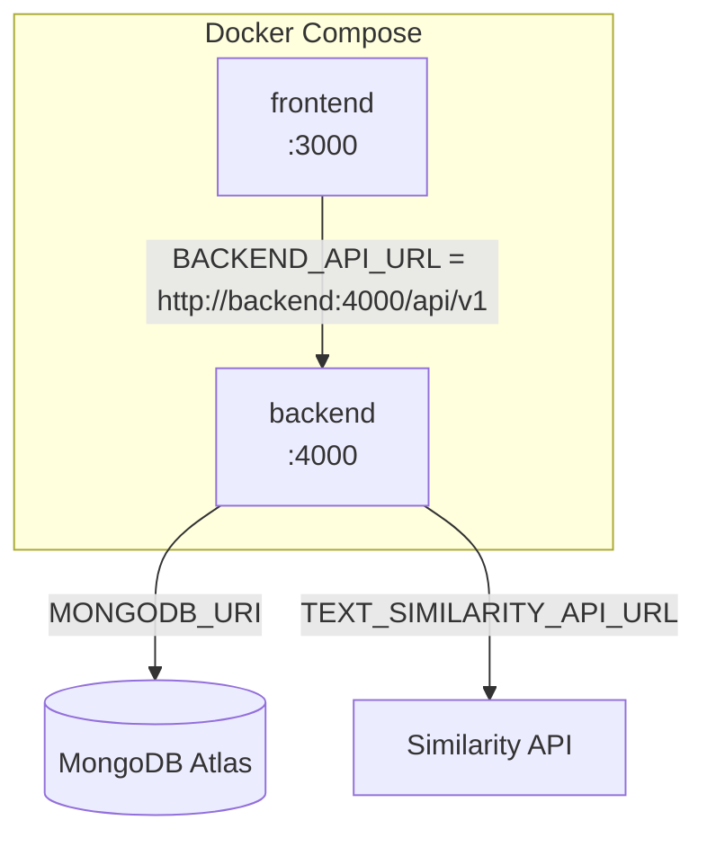
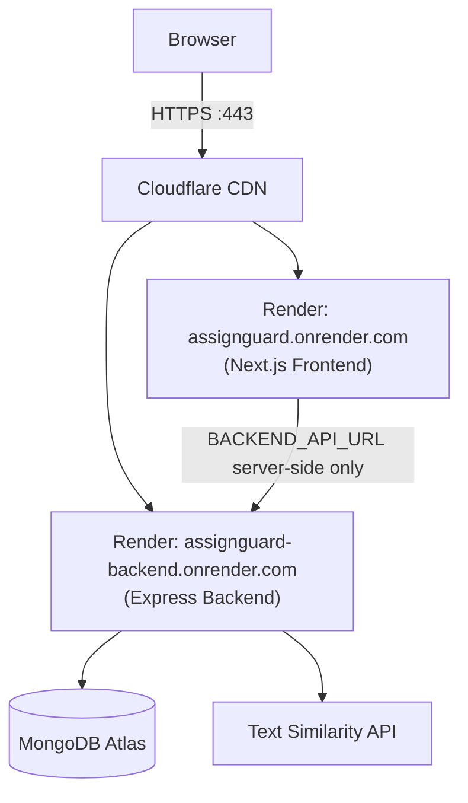

# AssignGuard — Design Document

| Field           | Value                                    |
|-----------------|------------------------------------------|
| **Project**     | AssignGuard                              |
| **Version**     | 1.1                                      |
| **Date**        | 2026-05-23                               |
| **Status**      | Deployed (Render)                        |
| **Repository**  | `Tarandeep9988/plagiarism-guard`         |

---

## Table of Contents

1. [Introduction](#1-introduction)
2. [Goals & Non-Goals](#2-goals--non-goals)
3. [System Architecture](#3-system-architecture)
4. [Data Models](#4-data-models)
5. [API Reference](#5-api-reference)
6. [Authentication & Authorization](#6-authentication--authorization)
7. [Plagiarism Detection](#7-plagiarism-detection)
8. [Frontend Architecture](#8-frontend-architecture)
9. [Deployment](#9-deployment)
10. [Security Considerations](#10-security-considerations)
11. [Future Considerations](#11-future-considerations)

---

## 1. Introduction

### 1.1 Purpose

AssignGuard is a full-stack web application designed for academic environments that enables **teachers** to create and manage assignments, **students** to submit their work, and provides **built-in plagiarism detection** by performing pairwise similarity analysis across all submissions for a given assignment.

### 1.2 Key Capabilities

- **Role-based access control** — Two distinct user personas (Teacher, Student) with enforced permission boundaries.
- **Assignment lifecycle management** — Full CRUD for assignments with due-date validation.
- **Student submissions** — Text-based submissions tied to an assignment, one per student per assignment.
- **Plagiarism analysis** — On-demand generation of pairwise similarity reports using an external NLP API.
- **Containerized deployment** — Docker Compose orchestration for reproducible, single-command deployment.

---

## 2. Goals & Non-Goals

### Goals

| # | Goal |
|---|------|
| G1 | Provide a clean, secure platform for teachers to create and manage assignments. |
| G2 | Allow students to discover available assignments and submit their work. |
| G3 | Generate plagiarism reports comparing all submissions for a given assignment. |
| G4 | Enforce strict role-based authorization (teachers vs. students). |
| G5 | Support containerized deployment via Docker Compose. |

### Non-Goals

| # | Non-Goal |
|---|----------|
| NG1 | File-upload–based submissions (currently text-only). |
| NG2 | Real-time notifications or WebSocket communication. |
| NG3 | Multi-tenant / multi-institution support. |
| NG4 | Grading or scoring of student submissions. |

---

## 3. System Architecture

### 3.1 High-Level Overview



### 3.2 Component Summary

| Component | Technology | Port | Responsibility |
|-----------|-----------|------|----------------|
| **Frontend** | Next.js 16, React 19, TailwindCSS 4 | 3000 | UI rendering, BFF proxy, auth state management |
| **Backend** | Express 5, TypeScript, Mongoose 9 | 4000 | REST API, business logic, data persistence |
| **Database** | MongoDB | 27017 | Persistent data storage |
| **Similarity API** | External (third-party) | — | Text similarity scoring via HTTP |

### 3.3 Backend-for-Frontend (BFF) Proxy

The frontend implements a **catch-all API route** at `src/app/api/[...path]/route.ts` that proxies all `/api/*` requests from the browser to the backend at `BACKEND_API_URL`. This architecture provides:

- **Cookie passthrough** — HTTP-only auth cookies set by the backend are transparently forwarded, avoiding CORS cookie complexity.
- **Backend opacity** — The browser never communicates directly with the backend; the backend URL is only known server-side.
- **Safe header forwarding** — Connection-level headers (`host`, `connection`, `content-length`, `transfer-encoding`, `accept-encoding`, `content-encoding`) are stripped from requests. The `cookie` header is explicitly forwarded via `req.headers.get('cookie')` since Next.js App Router's `forEach` iterator omits it for security reasons.
- **Response header sanitisation** — `Content-Encoding` and `Content-Length` are stripped from backend responses. The backend (behind Cloudflare on Render) returns brotli-compressed bodies; Node.js `fetch` decompresses them automatically, but the original compressed `Content-Length` would cause browsers to truncate the larger decompressed body.

```
Browser → /api/assignments → Next.js BFF Proxy → https://assignguard-backend.onrender.com/api/v1/assignments
```

---

## 4. Data Models

All models are defined using Mongoose and persisted in MongoDB. IDs are transformed from `_id` to `id` in JSON responses, and `__v` is stripped.

### 4.1 Entity-Relationship Diagram



### 4.2 Indexes

| Collection | Field(s) | Properties |
|------------|----------|------------|
| `users` | `email` | Unique |
| `assignments` | `userId` | Non-unique |
| `submissions` | `userId` | Non-unique |
| `reports` | `assignmentId` | Unique |

### 4.3 Model Details

#### User

| Field | Type | Constraints | Notes |
|-------|------|-------------|-------|
| `name` | String | required | — |
| `email` | String | required, unique (index) | — |
| `role` | String | enum: `student`, `teacher` | Defaults to `student` |
| `password` | String | required, `select: false` | bcrypt-hashed (10 salt rounds) |

#### Assignment

| Field | Type | Constraints | Notes |
|-------|------|-------------|-------|
| `title` | String | required | — |
| `description` | String | required | — |
| `dueDate` | Date | required | Must be in the future on creation |
| `userId` | ObjectId → User | required | The teacher who created it |

#### Submission

| Field | Type | Constraints | Notes |
|-------|------|-------------|-------|
| `content` | String | required | Text body of the submission |
| `userId` | ObjectId → User | required | The student who submitted |
| `assignmentId` | ObjectId → Assignment | required | — |

#### Report

| Field | Type | Constraints | Notes |
|-------|------|-------------|-------|
| `assignmentId` | ObjectId → Assignment | required, unique | One report per assignment |
| `comparisons` | Array of Comparison subdocs | — | Pairwise similarity results |

#### Comparison (subdocument)

| Field | Type | Notes |
|-------|------|-------|
| `student1ID` | ObjectId → User | Populated with `name` on read |
| `student2ID` | ObjectId → User | Populated with `name` on read |
| `similarityScore` | Number | 0–100, percentage |

---

## 5. API Reference

> **Base URL:** `/api/v1`
>
> **Response Envelope:** All responses follow a consistent format:
> ```json
> {
>   "success": true | false,
>   "message": "Human-readable description",
>   "data": { ... }
> }
> ```

### 5.1 Authentication

| Method | Endpoint | Auth | Body | Description |
|--------|----------|------|------|-------------|
| `POST` | `/login` | ✗ | `{ email, password }` | Authenticate and set JWT cookie |
| `POST` | `/register` | ✗ | `{ name, email, password, role }` | Create account and set JWT cookie |
| `POST` | `/logout` | ✗ | — | Clear JWT cookie |
| `GET` | `/verify` | ✓ | — | Verify current token validity |

### 5.2 Assignments

| Method | Endpoint | Auth | Role | Description |
|--------|----------|------|------|-------------|
| `GET` | `/assignments` | ✓ | Any | List assignments (teachers: own; students: all) |
| `GET` | `/assignments/:assignmentId` | ✓ | Any | Get single assignment |
| `POST` | `/assignments` | ✓ | Teacher | Create a new assignment |
| `PUT` | `/assignments/:assignmentId` | ✓ | Teacher | Update an assignment (partial) |
| `DELETE` | `/assignments/:assignmentId` | ✓ | Teacher | Delete assignment + its submissions |

### 5.3 Submissions

| Method | Endpoint | Auth | Role | Description |
|--------|----------|------|------|-------------|
| `POST` | `/assignments/:assignmentId/submissions` | ✓ | Student | Submit work for an assignment |
| `GET` | `/submissions` | ✓ | Student | List own submissions |
| `GET` | `/assignments/:assignmentId/submissions` | ✓ | Teacher | List all submissions for an assignment |
| `GET` | `/submissions/:submissionId` | ✓ | Any | Get a specific submission |
| `PUT` | `/submissions/:submissionId` | ✓ | Student | Update submission content |
| `DELETE` | `/submissions/:submissionId` | ✓ | Any | Delete a submission |

### 5.4 Reports

| Method | Endpoint | Auth | Role | Description |
|--------|----------|------|------|-------------|
| `GET` | `/assignments/:assignmentId/report` | ✓ | Teacher | Retrieve existing plagiarism report |
| `POST` | `/assignments/:assignmentId/report` | ✓ | Teacher | Generate a new plagiarism report |

### 5.5 Health

| Method | Endpoint | Auth | Description |
|--------|----------|------|-------------|
| `GET` | `/health` | ✗ | Server liveness check |

---

## 6. Authentication & Authorization

### 6.1 Authentication Flow



### 6.2 Token Details

| Property | Value |
|----------|-------|
| Algorithm | HS256 (jsonwebtoken default) |
| Payload | `{ userId: ObjectId }` |
| Expiry | 1 hour |
| Storage | HTTP-only cookie named `token` |
| Cookie Flags | `httpOnly`, `secure` (production), `sameSite: lax`, `maxAge: 3600000` |

### 6.3 Middleware Stack

The backend applies middleware in this order:

1. **`helmet()`** — Security headers
2. **`express.json()`** — JSON body parsing
3. **`cookieParser()`** — Cookie parsing
4. **`morgan("dev")`** — Request logging
5. **`authenticate`** (per-route) — Extracts and verifies JWT from cookie, loads user into `res.locals.user`
6. **`authorizeTeacher` / `authorizeStudent`** (per-route) — Role gate

### 6.4 Authorization Matrix

| Action | Unauthenticated | Student | Teacher |
|--------|:-:|:-:|:-:|
| Register / Login / Logout | ✓ | ✓ | ✓ |
| View assignments | ✗ | ✓ (all) | ✓ (own) |
| Create / Update / Delete assignment | ✗ | ✗ | ✓ |
| Submit to assignment | ✗ | ✓ | ✗ |
| View own submissions | ✗ | ✓ | ✗ |
| View assignment submissions | ✗ | ✗ | ✓ |
| Generate / View plagiarism report | ✗ | ✗ | ✓ |

---

## 7. Plagiarism Detection

### 7.1 Algorithm

Plagiarism detection is performed as a **pairwise comparison** of all submissions for a given assignment. For *n* submissions, this produces *n(n−1)/2* comparison pairs.



### 7.2 External API Integration

The similarity calculation delegates to an external **Text Similarity API**:

| Config Variable | Purpose |
|-----------------|---------|
| `TEXT_SIMILARITY_API_URL` | Endpoint URL for the comparison service |
| `TEXT_SIMILARITY_API_KEY` | API key passed as `X-Api-Key` header |

**Request:**
```json
POST <TEXT_SIMILARITY_API_URL>
Headers: { "X-Api-Key": "<key>" }
Body: { "text_1": "<submission1>", "text_2": "<submission2>" }
```

**Response:**
```json
{ "similarity": 0.87 }
```

The raw score (0.0–1.0) is multiplied by 100 to produce a percentage. Submissions with ≥50% similarity are flagged as "High Similarity" in the frontend.

### 7.3 Complexity

| Submissions (n) | API Calls | Time Complexity |
|:---:|:---:|:---:|
| 5 | 10 | O(n²) |
| 10 | 45 | O(n²) |
| 30 | 435 | O(n²) |
| 100 | 4,950 | O(n²) |

> [!WARNING]
> The current O(n²) approach is acceptable for class-sized cohorts (≤50 students) but will not scale to large course sections without architectural changes such as batching, queueing, or local similarity algorithms.

---

## 8. Frontend Architecture

### 8.1 Technology Stack

| Library | Version | Purpose |
|---------|---------|---------|
| Next.js | 16.2.6 | Framework (App Router, SSR, API routes) |
| React | 19.2.4 | UI library |
| TailwindCSS | 4 | Utility-first styling |
| Lucide React | 1.14.0 | Icon library |
| Axios | 1.16.0 | HTTP client |
| clsx + tailwind-merge | — | Conditional class composition |

### 8.2 Page Routing

| Route | Component | Access | Description |
|-------|-----------|--------|-------------|
| `/` | `DashboardPage` | Public / Auth | Landing page (unauthenticated) or assignment dashboard (authenticated) |
| `/login` | `LoginPage` | Public | Email + password login form |
| `/register` | `RegisterPage` | Public | Registration form with role selection |
| `/assignments/create` | `CreateAssignmentPage` | Teacher | Form to create a new assignment |
| `/assignments/[id]` | `AssignmentDetailPage` | Auth | Assignment details, submission form (students), submission list + plagiarism report (teachers) |
| `/submissions` | `SubmissionsPage` | Student | List of own past submissions |

### 8.3 State Management

- **Auth State:** Managed via React Context (`AuthContext`) wrapping the entire application.
  - On mount and route change, the context calls `GET /api/verify` to validate the existing JWT.
  - User data is cached in `localStorage` and cleared on logout or auth failure.
  - Protected routes redirect unauthenticated users to `/login`.

- **Page State:** Each page manages its own data-fetching state via `useState` + `useEffect`, issuing requests through the shared Axios instance (`/api/*` → BFF proxy).

### 8.4 Component Library

Custom UI components are in `src/components/ui/`:

| Component | File | Description |
|-----------|------|-------------|
| `Button` | `button.tsx` | Polymorphic button with variant support (`default`, `secondary`, `ghost`, `outline`, `destructive`) |
| `Card` | `card.tsx` | Composable card with `CardHeader`, `CardTitle`, `CardContent`, `CardFooter` |
| `Input` | `input.tsx` | Styled text input |

---

## 9. Deployment

AssignGuard supports two deployment modes: **local Docker Compose** and **Render cloud**.

### 9.1 Local — Docker Compose Architecture



### 9.2 Docker Compose Services

| Service | Image | Build Context | Exposed Port | Depends On |
|---------|-------|---------------|:---:|:---:|
| `frontend` | `assign-guard-frontend` | `./frontend` | 3000 | `backend` |
| `backend` | `assign-guard-backend` | `./backend` | 4000 | — |

### 9.3 Build Strategy

Both services use **multi-stage Docker builds**:

| Stage | Base | Action |
|-------|------|--------|
| **Builder** | `node:lts-slim` | Install all deps → compile TypeScript / Next.js |
| **Runtime** | `node:lts-slim` | Install prod deps only → copy compiled output |

- **Backend:** Compiles TypeScript to `dist/` via `tsc`, then runs `node dist/server.js`.
- **Frontend:** Runs `next build` (standard output mode), then starts with `next start`.

> **Note:** `output: 'standalone'` is **not** used. It is incompatible with `next start` and causes 404 errors on all API routes in production.

### 9.4 Cloud — Render Deployment

The application is deployed as two separate **Render Web Services** connected to the same MongoDB Atlas cluster.



| Service | Render URL | Runtime |
|---------|------------|---------|
| Frontend | `assignguard.onrender.com` | Node.js (Next.js) |
| Backend | `assignguard-backend.onrender.com` | Node.js (Express) |

> **Cloudflare note:** Render places all services behind Cloudflare. Cloudflare compresses responses with Brotli (`content-encoding: br`) and sets the compressed `content-length`. The BFF proxy decompresses responses automatically via Node.js `fetch`, so it must strip both `content-encoding` and `content-length` from forwarded response headers to prevent browsers from truncating the larger decompressed body.

### 9.5 Environment Variables

#### Backend

| Variable | Required | Description |
|----------|:---:|-------------|
| `PORT` | ✗ | Server port (default: `4000`) |
| `MONGODB_URI` | ✓ | MongoDB Atlas connection string |
| `JWT_SECRET` | ✓ | Secret key for signing JWTs |
| `TEXT_SIMILARITY_API_URL` | ✓ | URL for the plagiarism detection API |
| `TEXT_SIMILARITY_API_KEY` | ✓ | API key for the similarity service |
| `NODE_ENV` | ✗ | Set to `production` in cloud deployments |

#### Frontend

| Variable | Required | Description |
|----------|:---:|-------------|
| `BACKEND_API_URL` | ✓ | Backend API base URL — `http://backend:4000/api/v1` (Docker) or `https://assignguard-backend.onrender.com/api/v1` (Render) |

---

## 10. Security Considerations

### Implemented

| Control | Implementation |
|---------|---------------|
| **Password hashing** | bcrypt with 10 salt rounds |
| **JWT in HTTP-only cookie** | Prevents XSS-based token theft |
| **SameSite=Lax cookie** | Allows cookies on top-level navigations (required for BFF proxy redirect flows); mitigates CSRF on cross-site POST requests |
| **Secure cookie flag** | Enabled in production (HTTPS only) |
| **Helmet** | Sets security-related HTTP headers |
| **Input validation** | Zod schemas at every controller entry point |
| **Role-based authorization** | Middleware-enforced before route handlers |
| **Password exclusion** | `select: false` on User schema prevents accidental leakage |
| **Backend opacity** | Browser never directly contacts the backend; BFF proxy hides the backend URL |

### Recommendations for Hardening

| Area | Recommendation |
|------|---------------|
| Rate limiting | Add `express-rate-limit` to auth endpoints to prevent brute-force attacks |
| CSRF tokens | Consider adding CSRF tokens for additional protection on mutation endpoints |
| JWT refresh | Implement refresh-token rotation for longer sessions without extending JWT lifetime |
| Request logging | Add structured logging (e.g., Winston/Pino) for audit trails |
| Input sanitization | Sanitize text submissions to prevent stored XSS if content is rendered as HTML |
| Secrets management | Use a vault (e.g., HashiCorp Vault, AWS Secrets Manager) instead of `.env` files |

---

## 11. Future Considerations

| Area | Description | Priority |
|------|-------------|:---:|
| **File uploads** | Support file-based submissions (PDF, DOCX) with S3 or equivalent storage | High |
| **Local similarity engine** | Replace external API with a self-hosted NLP model (e.g., TF-IDF, BERT embeddings) to reduce latency and cost | High |
| **Job queue** | Offload plagiarism detection to a background worker (e.g., BullMQ + Redis) to prevent request timeouts | High |
| **Grading** | Allow teachers to grade submissions and provide feedback | Medium |
| **Notifications** | Email or in-app notifications for new assignments, approaching deadlines, and report completion | Medium |
| **Testing** | Add unit tests (Vitest), integration tests (Supertest), and E2E tests (Playwright) | Medium |
| **CI/CD** | Automate build, test, and deployment via GitHub Actions | Medium |
| **Multi-tenancy** | Support multiple institutions with isolated data partitions | Low |
| **Admin dashboard** | System-wide analytics and user management for administrators | Low |

---

*This document reflects the system as implemented. It should be updated as the architecture evolves.*
